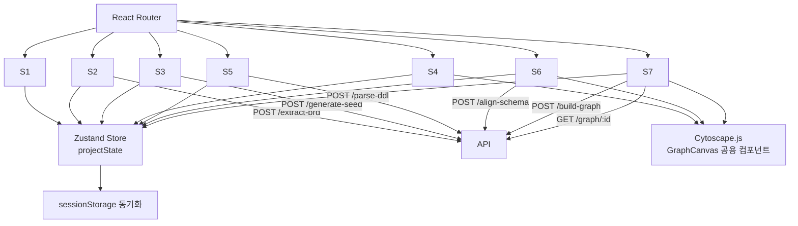

# Domain Pack Builder — 7화면 구조 개발 계획서 (v1)

> 생성일: 2026-06-17
> 작성자: claude
> 선행 문서: [../001-idea/260616-idea-sketch-detail-v2.md](../001-idea/260616-idea-sketch-detail-v2.md)
> 상태: 초안 — 화면 구현 관점 PRD/Dev Plan
> 스택: **React 18 + TypeScript + Vite + Tailwind + shadcn/ui + pnpm** + Cytoscape.js / Backend Go+Gin / Neo4j 5

---

## 0. 목적과 범위

본 문서는 v2 아이디어 스케치에서 정의한 **7화면 구조**를 실제로 구현하기 위한 PRD 겸 개발 계획서다. 백엔드 알고리즘·데이터 스키마는 v2 문서를 정본으로 참조하며, 본 문서는 **프론트엔드 화면 구현**과 **API 연동 시점**에 집중한다.

### 0.1 다루는 것

- 7개 화면의 라우팅·컴포넌트·상태 사양
- 기술 스택 고정값 (React+TS+Vite+Tailwind+shadcn/ui+pnpm) 과 디렉토리 구조
- 사용할 shadcn 컴포넌트 목록과 wrapper 컴포넌트 분리선
- API 연동 시점과 로딩/에러 처리
- Phase 1 (2h MVP) / Phase 2 (확장) 의 구현 분리선
- 화면 간 데이터 전달 / 전역 상태 모델

### 0.2 다루지 않는 것

- BRD·Project Seed·Alignment 스키마 상세 → v2 문서 §2
- Schema Alignment 알고리즘 → v2 문서 §5
- 백엔드 엔드포인트 내부 구현 → v2 문서 §4.1
- 인증·영속화·협업 → Phase 3 [확인 필요]

---

## 1. 요구사항 ID 매핑

| ID | 요구사항 | 화면 | Phase |
|---|---|---|---|
| R-001 | 매트릭스 + raw-data 입력 | S1 | 1 |
| R-002 | BRD 자동 추출 + 인라인 검토/수정 | S2 | 1 |
| R-003 | Question Set 5~8 + Project Seed 생성 | S3 | 1 |
| R-004 | Ontology 그래프 시각화 | S4 | 1 |
| R-005 | 기존 DB DDL 입력 + 파싱 | S5 | 2 |
| R-006 | Ontology ↔ DB 정렬 매핑 검토 | S6 | 2 |
| R-007 | Neo4j 적재 + 최종 그래프 + Export | S7 | 2 |
| R-NF-001 | LLM 호출 진행 표시 (스트리밍 또는 진행률 바) | S2, S3, S6, S7 | 1·2 |
| R-NF-002 | 50 클래스 이하 그래프 60fps 렌더 | S4, S6, S7 | 1·2 |
| R-NF-003 | 새로고침 시 진행 상태 보존 (sessionStorage) | 전 화면 | 1 |
| R-ERR-001 | LLM 실패 시 재시도 + 부분 결과 보존 | S2, S3 | 1 |
| R-ERR-002 | DDL 파서 실패 시 라인 단위 에러 표시 | S5 | 2 |

---

## 1.5. 기술 스택 (Fixed)

추측 금지. 아래 값으로 박아넣고 시작한다.

### 1.5.1 런타임·빌드

| 영역 | 선택 | 버전 [가정] |
|---|---|---|
| 패키지 매니저 | **pnpm** | 9.x |
| 번들러/Dev | **Vite** | 5.x |
| 언어 | **TypeScript** | 5.4+ (strict 모드) |
| 프레임워크 | **React** | 18.x |
| 스타일 | **Tailwind CSS** | 3.4+ |
| UI 프리미티브 | **shadcn/ui** (Radix UI 기반, copy-in 컴포넌트) | latest |
| 라우팅 | **react-router-dom** | 6.x |
| 상태 | **Zustand** + `persist` 미들웨어 (sessionStorage) | 4.x |
| HTTP | **TanStack Query (react-query) v5** + **axios** | v5 / 1.x |
| 폼 | **react-hook-form** + **zod** resolver | 7.x / 3.x |
| 그래프 | **cytoscape** + `cytoscape-cose-bilkent` | 3.x |
| 아이콘 | **lucide-react** (shadcn 기본) | latest |
| 토스트 | **sonner** (shadcn 권장) | latest |
| 유틸 | **clsx**, **tailwind-merge**, **class-variance-authority** | latest |
| Lint/Format | **ESLint** + **Prettier** + **eslint-plugin-tailwindcss** | latest |
| 테스트 | **Vitest** (단위) + **@testing-library/react** + **Playwright** (E2E) | latest |

> Next.js / npm / yarn / styled-components / MUI / Chakra 등 제안 금지.
> 새 라이브러리 추가 전에는 shadcn 컴포넌트로 대체 가능한지 먼저 검토.

### 1.5.2 shadcn/ui 사용 컴포넌트 (예정)

| shadcn 컴포넌트 | 본 문서 사용처 |
|---|---|
| `button` | 전 화면 PrimaryButton 베이스 |
| `card` | S2 BRD 섹션, S3 Question 카드, S6 매칭 카드 |
| `tabs` | S3 Seed 4탭 |
| `dialog` | 항목 편집 모달 (필요 시) |
| `sheet` | S4/S6/S7 사이드패널 |
| `tooltip` | EvidenceBadge hover |
| `badge` | category, method, confidence 라벨 |
| `input`, `textarea` | S1 raw-data, S5 DDL |
| `select` | S5 dbType |
| `toggle`, `switch` | S6 approved 토글, S4 필터 |
| `progress` | ProgressOverlay |
| `skeleton` | 화면 로딩 상태 |
| `scroll-area` | 사이드패널, 트리뷰 |
| `accordion` | S6 컬럼 매핑 펼치기 |
| `alert` | 에러 배너 |
| `command` | (옵션) 빠른 노드 검색 |
| `toaster` (sonner) | 진입 가드 안내 |

> shadcn 컴포넌트는 `pnpm dlx shadcn@latest add <name>` 으로 개별 추가. 최초 `init` 시 `New York` 스타일 + `slate` base color [가정].

### 1.5.3 디렉토리 구조

```
frontend/
├── package.json
├── pnpm-lock.yaml
├── vite.config.ts
├── tailwind.config.ts
├── tsconfig.json
├── components.json              # shadcn 설정
├── index.html
├── src/
│   ├── main.tsx
│   ├── App.tsx                  # Router + Providers
│   ├── routes/                  # 화면 단위 (S1~S7)
│   │   ├── input.tsx            # S1
│   │   ├── brd-review.tsx       # S2
│   │   ├── question-seed.tsx    # S3
│   │   ├── graph-ontology.tsx   # S4
│   │   ├── db-input.tsx         # S5
│   │   ├── alignment.tsx        # S6
│   │   └── graph-final.tsx      # S7
│   ├── components/
│   │   ├── ui/                  # shadcn copy-in (button, card, ...)
│   │   ├── common/              # StepHeader, EvidenceBadge, ProgressOverlay, PrimaryButton
│   │   ├── graph/               # GraphCanvas, GraphToolbar, NodeDetailPanel
│   │   ├── brd/                 # BrdSection, InlineEditField
│   │   ├── seed/                # QuestionCard, SeedTabs, CategoryDiversityIndicator
│   │   ├── db/                  # DdlInput, TableTreeView, ParseErrorList
│   │   └── alignment/           # MatchingList, UnmappedSection
│   ├── stores/
│   │   └── project-store.ts     # Zustand + persist(sessionStorage)
│   ├── api/
│   │   ├── client.ts            # axios instance
│   │   ├── brd.ts               # /extract-brd
│   │   ├── seed.ts              # /generate-seed
│   │   ├── db.ts                # /parse-ddl, /align-schema
│   │   └── graph.ts             # /build-graph, /graph/:id
│   ├── hooks/
│   │   ├── use-ensure-step.ts   # 진입 조건 가드
│   │   └── use-graph-progress.ts # WS 구독
│   ├── lib/
│   │   ├── utils.ts             # cn() (clsx+tailwind-merge)
│   │   └── cyto-mapper.ts       # ProjectSeed → Cytoscape JSON
│   ├── types/                   # BRD, ProjectSeed, AlignmentMap, ...
│   ├── fixtures/                # Phase 1 픽스처 (3 매트릭스 조합)
│   └── styles/
│       └── globals.css          # Tailwind layers + shadcn vars
└── tests/
    ├── e2e/                     # Playwright
    └── unit/                    # Vitest
```

### 1.5.4 초기 부트스트랩 명령 (참고)

```bash
pnpm create vite@latest frontend -- --template react-ts
cd frontend
pnpm add react-router-dom zustand @tanstack/react-query axios \
        react-hook-form zod @hookform/resolvers \
        cytoscape cytoscape-cose-bilkent \
        clsx tailwind-merge class-variance-authority lucide-react sonner
pnpm add -D tailwindcss postcss autoprefixer eslint prettier \
            eslint-plugin-tailwindcss \
            vitest @testing-library/react @testing-library/jest-dom jsdom \
            @playwright/test
pnpm dlx tailwindcss init -p
pnpm dlx shadcn@latest init
pnpm dlx shadcn@latest add button card tabs dialog sheet tooltip badge \
                            input textarea select switch toggle progress \
                            skeleton scroll-area accordion alert sonner
```

---

## 2. 전체 아키텍처 (프론트엔드 관점)



### 2.1 라우팅

| Path | 화면 | Guard |
|---|---|---|
| `/` | S1 Input | — |
| `/brd` | S2 BRD Review | `brd` 존재 |
| `/seed` | S3 Question + Seed | `projectSeed` 존재 |
| `/graph/ontology` | S4 Ontology Graph | `projectSeed` 존재 |
| `/db` | S5 DB Schema Input | `projectSeed` 존재 |
| `/align` | S6 Alignment Review | `alignment` 존재 |
| `/graph/final` | S7 Final Graph + Export | `buildResult` 존재 |

- 진입 조건 미충족 시 **마지막 유효 화면으로 redirect** + 토스트 안내
- 헤더에 step indicator (`1 ─ 2 ─ 3 ─ 4 ─ 5 ─ 6 ─ 7`) — 완료된 step만 클릭 가능

### 2.2 전역 상태 (Zustand)

```ts
type ProjectState = {
  projectId: string  // uuid, S1 진입 시 발급
  matrix: { industry: string; functions: string[] } | null
  rawData: RawDataItem[]
  brd: BRD | null
  questions: QuestionSet | null
  projectSeed: ProjectSeed | null
  existingDb: ExistingDb | null     // Phase 2
  alignment: AlignmentMap | null    // Phase 2
  buildResult: BuildResult | null   // Phase 2
  // UI
  loading: Record<Stage, boolean>
  errors: Record<Stage, string | null>
}
```

- sessionStorage에 `projectId`별로 직렬화. 새로고침 복원.
- 화면 이동은 상태만 보고 결정 (URL 직접 접근도 동일하게 동작).

---

## 3. 화면별 상세 사양

각 화면은 다음 8개 항목을 기재한다: **진입 조건 / 레이아웃 / 주요 컴포넌트 / 상태 / API / 사용자 액션 / 로딩·에러 / Phase**.

---

### S1. Input (매트릭스 + Raw Data)

- **진입 조건**: 항상 (랜딩)
- **레이아웃**: 단일 컬럼, 상단 매트릭스 셀렉터 / 하단 raw-data 카드 리스트
- **주요 컴포넌트**
  - `<MatrixSelector />` — 산업(4) × 기능(3) 매트릭스. 활성 9조합만 클릭 가능.
  - `<RawDataCard />` — type(meeting/email/chat) + date + content. `+ 추가` 버튼으로 N개 누적.
  - `<PrimaryButton label="BRD 추출 시작" />` — disabled until matrix + rawData ≥ 1
- **상태**: `matrix`, `rawData[]`
- **API**: 없음 (다음 화면 진입 시 호출)
- **사용자 액션**
  - 매트릭스 셀 클릭 → industry/functions 토글
  - 카드 추가/삭제/편집
  - 시작 버튼 → `POST /extract-brd` 호출 후 `/brd` 이동
- **로딩·에러**
  - 버튼 클릭 시 버튼 자체 spinner, 화면 전환은 응답 후
  - 실패 시 화면 유지 + 인라인 에러 배너
- **Phase**: 1

---

### S2. BRD Review

- **진입 조건**: `brd` 존재
- **레이아웃**: 2열 — 좌(8/12) BRD 섹션 카드 / 우(4/12) raw-data 인용 미리보기 패널
- **주요 컴포넌트**
  - `<BrdSection />` — 9개 섹션 (objective/stakeholders/keyEntities/entityAttributes/businessProcesses/kpis/dataSources/painPoints/decisionPoints)
  - `<EvidenceBadge source="meeting:2026-05-12:line-42" />` — 클릭 시 우측 패널 하이라이트
  - `<InlineEditField />` — 항목 클릭으로 편집 모드 진입, blur로 저장
  - `<PrimaryButton label="Question + Seed 생성" />`
- **상태**: `brd` (편집 가능, dirty flag)
- **API**: 진입 시 별도 호출 없음. 버튼 클릭 시 `POST /generate-seed` (rawData도 함께 송신해 인용 검증).
- **사용자 액션**
  - 항목 인라인 편집 / 추가 / 삭제
  - evidence 배지 클릭 → 우측 raw-data 인용 위치 스크롤 + 하이라이트
  - 다음 단계 진행
- **로딩·에러**
  - 진입 시 화면 자체 로딩은 없음 (S1에서 받아옴)
  - Stage 2 호출 중 progress overlay
  - LLM 실패 시 BRD 편집 상태 보존 + 재시도 버튼 (R-ERR-001)
- **Phase**: 1

---

### S3. Question + Seed

- **진입 조건**: `projectSeed` 존재
- **레이아웃**: 2열 — 좌(5/12) Question Set / 우(7/12) Seed 탭
- **주요 컴포넌트**
  - `<QuestionCard />` — id, question, category 뱃지(diagnostic/monitoring/decision/predictive), priority, evidence 배지
  - `<CategoryDiversityIndicator />` — "현재 3종 카테고리 충족" 같은 라벨 (5~8개·최소 3종 검증)
  - `<SeedTabs />` — 4 탭: Ontology / Workflow / KPI / Source
    - Ontology 탭: nodes·relations 표
    - Workflow 탭: 단계화된 리스트
    - KPI 탭: 정의·공식·target 테이블
    - Source 탭: 시스템 ↔ class 매핑 표
  - `<PrimaryButton label="Ontology Graph 보기" />` → `/graph/ontology`
- **상태**: `questions`, `projectSeed` (읽기 전용, v3에서 편집)
- **API**: 없음
- **사용자 액션**
  - 탭 전환
  - Question 카드 클릭 시 requiredClasses 하이라이트 (S4와 연동되는 deepLink: classId 쿼리)
  - 다음 단계 진행
- **로딩·에러**: 없음 (S2에서 받아옴)
- **Phase**: 1

---

### S4. Ontology Graph View

- **진입 조건**: `projectSeed` 존재
- **레이아웃**: 좌(9/12) 그래프 캔버스 / 우(3/12) 사이드패널 (선택 노드 상세)
- **주요 컴포넌트**
  - `<GraphCanvas />` — Cytoscape.js, `cose-bilkent` 레이아웃
    - 노드 컬러: Class(파랑) / KPI(초록) / Workflow(보라) / Property(노랑)
    - 엣지 라벨: triggers/has/depends_on
  - `<GraphToolbar />` — 노드 타입 필터 토글, 줌 리셋, 레이아웃 재실행
  - `<NodeDetailPanel />` — 선택 노드의 definition / BRD 인용 / sourceBrdPath
  - `<PrimaryButton label="DB 스키마 입력으로 진행" />` → `/db`
- **상태**: `selectedNodeId`, `filters: Set<NodeType>`
- **API**: 없음 (projectSeed에서 Cytoscape JSON 변환)
- **사용자 액션**
  - 노드 클릭 → 사이드패널
  - 빈 캔버스 클릭 → 사이드패널 닫힘
  - 필터 토글로 노드 타입 숨김
  - 다음 단계 진행 (Phase 1에서는 "데모 종료" 버튼으로 대체 가능)
- **로딩·에러**
  - 캔버스 초기화 중 skeleton
  - Cytoscape import는 dynamic import로 코드 스플릿
- **Phase**: 1

---

### S5. DB Schema Input

- **진입 조건**: `projectSeed` 존재
- **레이아웃**: 2열 — 좌(6/12) DDL 입력 영역 / 우(6/12) 파싱 결과 트리뷰
- **주요 컴포넌트**
  - `<DdlInput />` — large textarea + `.sql` 파일 업로드 버튼 (drag&drop)
  - `<DbTypeSelector />` — postgres / mysql / oracle (MVP는 postgres만 동작)
  - `<PrimaryButton label="파싱" />` → `POST /parse-ddl`
  - `<TableTreeView />` — 파싱된 테이블·컬럼 트리. 컬럼 타입·PK·FK·코멘트 표시
  - `<ParseErrorList />` — 파싱 실패 라인 (R-ERR-002)
  - `<PrimaryButton label="정렬 검토" />` → `POST /align-schema` → `/align`
- **상태**: `existingDb`, `ddlRawText`, `parseErrors[]`
- **API**: `POST /parse-ddl`, `POST /align-schema`
- **사용자 액션**
  - 텍스트 paste / 파일 업로드
  - dbType 선택
  - 파싱 → 결과 확인 → 정렬 진행
- **로딩·에러**
  - 파일 업로드 5MB 제한 [가정]
  - 파싱 에러는 라인 번호 + 메시지로 우측 패널 상단에 표시
- **Phase**: 2 (Phase 1에서는 **목업 화면**으로 정적 트리뷰만 노출)

---

### S6. Alignment Review

- **진입 조건**: `alignment` 존재
- **레이아웃**: 3열 — 좌(4/12) ontology 그래프 (S4와 동일 캔버스 공유) / 중(4/12) 매칭 리스트 / 우(4/12) DB 테이블 트리
- **주요 컴포넌트**
  - `<GraphCanvas mode="alignment" />` — Class 노드만, 선택 시 우측 트리 해당 테이블 강조
  - `<MatchingList />` — 매칭 항목 카드
    - ontologyClass ↔ existingTable
    - confidence bar (색상: 0~0.6 빨강 / 0.6~0.85 노랑 / 0.85~1 초록)
    - method 배지 (exact / fuzzy / llm)
    - 컬럼 매핑 펼치기 (accordion)
    - 승인/거부 토글 (approved boolean)
  - `<UnmappedSection />` — `unmappedClasses` / `unmappedTables`
  - `<DbTreeView />` — S5 트리 재사용, 매칭된 테이블은 ontology class 라벨 배지 표시
  - `<PrimaryButton label="그래프 빌드" />` → `POST /build-graph` → `/graph/final`
- **상태**: `alignment` (mappings[].approved 편집 가능)
- **API**: `POST /build-graph`
- **사용자 액션**
  - 매칭 항목 승인/거부 토글
  - 컬럼 매핑 individual 토글
  - 그래프 노드 클릭 → 매칭 리스트 해당 카드 스크롤
  - 빌드 진행
- **로딩·에러**
  - 빌드 호출 시 WS `/graph-progress` 구독 → progress overlay (Neo4j 적재 시간 대응)
- **Phase**: 2

---

### S7. Final Graph + Export

- **진입 조건**: `buildResult` 존재
- **레이아웃**: 좌(9/12) 그래프 캔버스 / 우(3/12) Export 패널
- **주요 컴포넌트**
  - `<GraphCanvas mode="final" />` — Class(파랑) + KPI(초록) + Table(회색) + Workflow(보라) 모두 표시
    - `GET /graph/:projectId` 응답 (Cytoscape JSON) 그대로 주입
  - `<GraphLegend />` — 컬러 범례
  - `<ExportPanel />`
    - Cypher 스크립트 다운로드 (`.cypher`)
    - 전체 JSON 다운로드 (`.json`)
    - Markdown 리포트 다운로드 (`.md`)
    - Neo4j Browser URL 복사 버튼
  - `<BuildSummary />` — 적재된 노드/엣지 수, 소요 시간
- **상태**: `buildResult`, `graphCytoJson`
- **API**: `GET /graph/:projectId`
- **사용자 액션**
  - 노드 클릭 → 사이드패널 (BRD/DB 원본 인용)
  - Export 버튼들
- **로딩·에러**
  - 그래프 적재 직후 진입 → 첫 GET 응답까지 skeleton
- **Phase**: 2

---

## 4. 공용 컴포넌트

shadcn 기본 컴포넌트는 그대로 사용하고, 본 프로젝트 도메인 로직은 아래 wrapper 컴포넌트에서 캡슐화한다.

| 컴포넌트 | 위치 | 베이스 (shadcn) | 사용 화면 | 비고 |
|---|---|---|---|---|
| `<StepHeader />` | `components/common/` | `badge` + `button` | 전 화면 | 1~7 step indicator, 완료 step만 클릭 가능 |
| `<PrimaryButton />` | `components/common/` | `button` | 전 화면 | `loading` prop → spinner (lucide `Loader2`), variant 고정 |
| `<EvidenceBadge />` | `components/common/` | `badge` + `tooltip` | S2, S3, S4·S7 사이드패널 | 클릭 시 raw-data 미리보기 sheet |
| `<ProgressOverlay />` | `components/common/` | `dialog` + `progress` | S2, S3, S6, S7 | 풀스크린 modal, WS progress(%) (R-NF-001) |
| `<GraphCanvas mode="..." />` | `components/graph/` | (custom canvas) | S4, S6, S7 | Cytoscape.js, dynamic import, mode별 필터 |
| `<GraphToolbar />` | `components/graph/` | `toggle` + `button` | S4, S6, S7 | 노드 타입 필터, 줌 리셋, 레이아웃 재실행 |
| `<NodeDetailPanel />` | `components/graph/` | `sheet` + `scroll-area` | S4, S6, S7 | 선택 노드 상세 + BRD/DB 인용 |
| `<TableTreeView />` | `components/db/` | `accordion` + `scroll-area` | S5, S6 | 테이블·컬럼 트리, 매칭 배지 |
| `<MatchingCard />` | `components/alignment/` | `card` + `switch` + `accordion` | S6 | confidence bar + approved 토글 |
| `<ErrorBanner />` | `components/common/` | `alert` | 전 화면 | 재시도 버튼 슬롯 (R-ERR-001/002) |

---

## 5. 디자인 토큰 (MVP 최소)

shadcn `init` 기본 (New York / slate) 위에 도메인 전용 토큰만 얹는다. `tailwind.config.ts`의 `theme.extend.colors` 와 `src/styles/globals.css`의 CSS variable로 동시 노출한다.

```ts
// tailwind.config.ts 발췌
theme: {
  extend: {
    colors: {
      // shadcn 기본 토큰 (primary, secondary, accent, muted, destructive, ...) 유지
      graph: {
        class:    'hsl(217 91% 60%)',  // blue-500
        kpi:      'hsl(160 84% 39%)',  // emerald-500
        workflow: 'hsl(258 90% 66%)',  // violet-500
        source:   'hsl(220  9% 46%)',  // gray-500
        property: 'hsl( 45 93% 47%)',  // yellow-500
      },
      confidence: {
        low:  'hsl(  0 84% 60%)',
        mid:  'hsl( 38 92% 50%)',
        high: 'hsl(160 84% 39%)',
      },
    },
    fontFamily: {
      sans: ['Inter', 'Pretendard', 'system-ui', 'sans-serif'],
    },
  },
}
```

| 토큰 | 용도 | 값 (HSL) |
|---|---|---|
| `graph-class` | Ontology Class 노드 | blue-500 |
| `graph-kpi` | KPI 노드 | emerald-500 |
| `graph-workflow` | Workflow 노드 | violet-500 |
| `graph-source` | DB Table 노드 | gray-500 |
| `graph-property` | Property 노드 | yellow-500 |
| `confidence-low / mid / high` | S6 매칭 신뢰도 bar | red / amber / emerald |

폰트는 Inter + Pretendard fallback (한글). 다크 모드는 shadcn 기본 다크 vars 사용 — 그래프 노드 컬러는 라이트/다크 동일.

상세 디자인 시스템은 [확인 필요] — UI 디자이너 합류 시 토큰 확정.

---

## 6. 구현 마일스톤

### Phase 1 — 2시간 MVP (해커톤 데모 직전까지)

| 순서 | 작업 | 소요(분) [가정] |
|---|---|---|
| 1 | 부트스트랩: `pnpm create vite` → Tailwind + `shadcn init` + Router + Zustand + react-query | 15 |
| 2 | shadcn 컴포넌트 `add` (button/card/tabs/sheet/dialog/badge/progress/...) + 공용 컴포넌트 골격 | 10 |
| 3 | S1 Input + sessionStorage 동기화 | 15 |
| 4 | S2 BRD Review + `/extract-brd` 연동 + 인라인 편집 | 20 |
| 5 | S3 Question + Seed + `/generate-seed` 연동 + 탭 | 20 |
| 6 | S4 GraphCanvas (dynamic import) + `cose-bilkent` + 사이드패널 | 25 |
| 7 | S5~S7 **목업 화면** (정적 픽스처) | 10 |
| 8 | StepHeader / EvidenceBadge / ProgressOverlay 마무리 | 10 |
| 9 | 데모 시나리오 리허설 + 픽스처 점검 | 15 |

총 140분 (버퍼 20분).

### Phase 2 — 추가 4~6시간

| 순서 | 작업 |
|---|---|
| 1 | S5 DDL 입력 + `/parse-ddl` 연동 + 파서 에러 처리 |
| 2 | S6 Alignment Review + 매칭 토글 + 신뢰도 표시 |
| 3 | WS `/graph-progress` 구독 + ProgressOverlay 확장 |
| 4 | S7 최종 그래프 (`/build-graph`, `/graph/:id`) + Export 3종 |
| 5 | Cypher/JSON/Markdown 다운로드 |

### Phase 3 — Out of scope (참고)

- 영속 프로젝트 저장
- 사용자 인증·협업
- 파일 업로드 / OCR
- 라이브 DB 커넥션 (`information_schema`)

---

## 7. 화면 간 데이터 전달 규칙

- **상태는 Zustand 단일 저장소**. props로 화면 간 전달 금지.
- 화면 진입 시 진입 조건 가드 함수에서 redirect 결정 (`useEnsureStep(step)` 훅).
- API 응답 받는 즉시 store에 반영 → 다음 화면은 store만 의존.
- sessionStorage 직렬화는 디바운스 300ms.

---

## 8. 로딩·에러 UX 일관 규칙

| 상황 | UX |
|---|---|
| LLM 호출 중 | Stage 진입 화면에 `<ProgressOverlay />` 풀스크린, 취소 버튼 없음 (MVP) |
| LLM 실패 | 직전 화면 유지 + 인라인 에러 배너 + 재시도 버튼. 사용자 편집 상태 보존. |
| DDL 파싱 실패 | 우측 패널에 라인별 에러. 일부 성공 시 partial 트리 표시. |
| Neo4j 적재 진행 | WS progress(%) ProgressOverlay에 표시 |
| 진입 조건 미충족 | 토스트 "이전 단계를 먼저 완료하세요" + 마지막 유효 화면으로 redirect |

---

## 9. 리스크

| 리스크 | 영향 | 완화 |
|---|---|---|
| Cytoscape 첫 렌더 지연 | S4 진입 체감 느림 | dynamic import + skeleton |
| LLM 호출 6~10초 누적 | Stage 2·3에서 사용자 이탈 | ProgressOverlay + 단계별 분리 (S2 → S3 별도 클릭) |
| Phase 1 목업 → Phase 2 실동작 전환 시 인터페이스 변경 | 재작업 | S5~S7 컴포넌트의 props 시그니처는 Phase 2 기준으로 미리 확정 |
| 새로고침 시 상태 유실 | 데모 사고 | sessionStorage 동기화 (R-NF-003) |
| 그래프 노드 50개 초과 | 렌더 끊김 | MVP는 50개 이하 픽스처로 제한, v2에서 클러스터링 |

---

## 10. 다음 단계

1. 본 문서로 합의 → 필요 시 v2 아이디어 스케치와 정합성 검토
2. `/tdd-write` 로 7화면별 테스트 명세 작성 (Playwright E2E + 컴포넌트 단위)
3. `/lld-write` 로 컴포넌트 트리·훅·API 클라이언트 LLD 작성
4. Phase 1 구현 착수 — S1~S4 실동작 + S5~S7 목업
5. Phase 2 착수 전에 Neo4j 컨테이너 + Cypher 변환기 PoC 선행 확인

---

## 11. 부록 — Cytoscape JSON 변환 규칙 (S4/S6/S7 공통)

Project Seed / Alignment / Build Result를 Cytoscape elements 포맷으로 변환할 때 따르는 규칙. 변환은 프론트엔드에서 수행한다 [가정] — 백엔드가 Cytoscape 포맷을 직접 내려주면 더 간단하지만, MVP는 프론트 변환으로 시작.

```ts
type CyElement =
  | { data: { id: string; label: string; type: NodeType; meta?: object } }
  | { data: { id: string; source: string; target: string; label: string } }

// ontology.nodes → Class/Property 노드
// ontology.relations → 엣지
// kpiGlossary → KPI 노드 + dependsOnClasses 별 DEPENDS_ON 엣지
// workflows → Workflow 노드 + steps의 uses/produces 별 엣지
// alignment.mappings (mode='alignment'/'final') → Table 노드 + MAPPED_TO 엣지
```

화면별 필터:

- S4 (`mode='ontology'`): Class / Property / KPI / Workflow 만
- S6 (`mode='alignment'`): Class + Table (다른 타입 숨김)
- S7 (`mode='final'`): 전체
