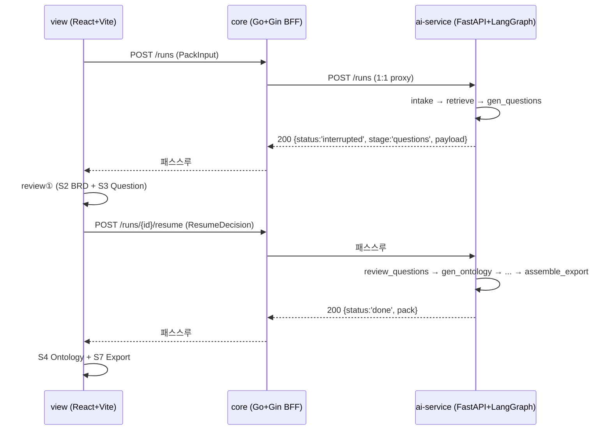
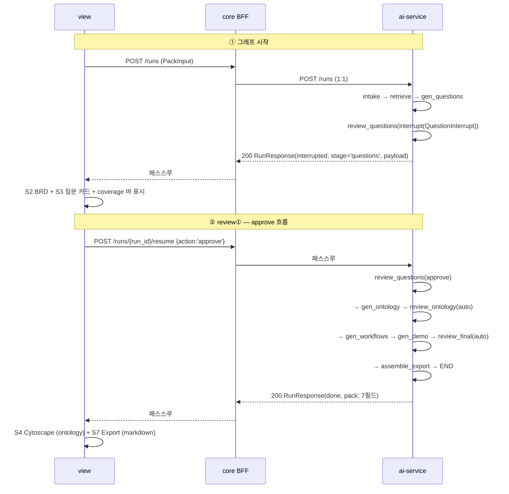

# Domain Pack Builder ai-service — API 스펙 (v0.1.0-a1s1)

> 정본 OpenAPI JSON: [`openapi.json`](./openapi.json) (FastAPI 자동 생성)
> 갱신 방법: §12
> 연동 가이드: [`docs/integration/handoff-to-W-2026-06-18.md`](../integration/handoff-to-W-2026-06-18.md)
> 변경 정책: §9 (T10 freeze)

---

## 0. 개요

LangGraph 기반 도메인 팩 생성 파이프라인. **단일 라이브 검토 게이트(review①, `stage="questions"`)** 만 인터럽트하고 나머지는 자동 흐름. 그래프 종료 시 7 필수 필드의 `pack` 반환.

### 0.1 시스템 토폴로지



---

## 1. 베이스 URL / 가동

| 환경 | URL |
|---|---|
| 개발 (포트 자유) | `http://127.0.0.1:8000` |
| 개발 (Cursor IDE 점유 우회, [D-9](../decisions_a1_v1.md)) | `http://127.0.0.1:<dynamic>` (보통 8765 / 8888 / 9000 중 빈 포트) |
| 운영 (k8s 가정) | `http://ai-service:8000` |

### 1.1 가동 (개발)

```bash
cd ai-service
uv venv --python 3.13 .venv && source .venv/bin/activate
uv pip install -r requirements.txt

# 빈 포트 자동 탐색 (D-9 패턴)
for p in 8765 8888 9000 9001; do
  lsof -i :$p >/dev/null 2>&1 || { PORT=$p; break; }
done

uvicorn app:app --host 127.0.0.1 --port $PORT --log-level warning
# 검증: curl http://127.0.0.1:$PORT/healthz   →   {"status":"ok"}
```

### 1.2 환경변수

| 변수 | 용도 | 기본값 |
|---|---|---|
| `ANTHROPIC_API_KEY` | LLM 토글 (있으면 enhance, 없으면 canned fallback) | (미설정 시 fallback) |
| `LLM_MODEL` | Claude 모델 ID override | `claude-sonnet-4-6` |

`.env` 로드 (`python-dotenv`). `.env` 는 `.gitignore` 처리됨.

---

## 2. 인증 / CORS / 보안

| 항목 | 현재 (개발) | 향후 (운영) |
|---|---|---|
| 인증 | 없음 | BFF 경계 토큰 검증 |
| CORS | `allow_origins=["*"]` | view origin 화이트리스트 |
| `ANTHROPIC_API_KEY` | ai-service 환경변수, request 본문에 없음 | k8s Secret 등 비밀 보관소 |
| PII | 미마스킹 (input documents 그대로 처리) | intake parser 단계 마스킹 (F-K3) |

---

## 3. 공통 응답 — `RunResponse`

모든 `/runs`·`/runs/{id}/resume` 응답이 동일 스키마. `status` 로 두 분기.

### 3.1 일시정지 (interrupt)

```json
{
  "run_id": "401c2cb0-ea37-40c9-8faf-d89b57da622c",
  "status": "interrupted",
  "stage": "questions",
  "payload": {
    "stage": "questions",
    "brd": { /* ProblemProfile — §5.4 */ },
    "items": [ /* BusinessQuestion[] — §5.3 */ ],
    "coverage": { "covered": [...], "missing": [...] }
  },
  "pack": null
}
```

### 3.2 완료 (done)

```json
{
  "run_id": "...",
  "status": "done",
  "stage": null,
  "payload": null,
  "pack": {
    "industry": "distribution",
    "business_questions": [ /* ... */ ],
    "ontology": { "nodes": [...], "relations": [...] },
    "workflows": [ /* ... */ ],
    "demo_scenario": { /* ... */ },
    "required_sources": { "available": [...], "needed": [...] },
    "export": { "markdown": "# PoC 셋업 체크리스트\n..." }
  }
}
```

### 3.3 필드 명세

| 필드 | 타입 | 필수 | 설명 |
|---|---|---|---|
| `run_id` | `string` (UUID v4) | ✅ | 그래프 thread id. resume 호출 시 동일 사용 |
| `status` | `"interrupted" \| "done"` | ✅ | 분기 키 |
| `stage` | `string \| null` | interrupted 일 때 필수 | 현재 `"questions"` 만 |
| `payload` | `object \| null` | interrupted 일 때 필수 | stage 별 페이로드 ([§5.10](#510-questioninterrupt-interrupt-payload)) |
| `pack` | `object \| null` | done 일 때 필수 | [`DomainPackOutput`](#59-domainpackoutput-pack) |

---

## 4. 엔드포인트

### 4.1 `GET /healthz`

서버 헬스 체크.

| | |
|---|---|
| 요청 | 없음 |
| 응답 200 | `{"status":"ok"}` |
| 권한 | 공개 |
| 호출 빈도 | BFF가 startup probe + readiness probe로 사용 |

---

### 4.2 `POST /runs`

새 그래프 thread 시작. `intake → retrieve → gen_questions` 까지 자동 진행 후 `review_questions` 에서 일시정지.

**요청 헤더**: `Content-Type: application/json`

**요청 본문**: [`PackInputDTO`](#51-packinput)

```json
{
  "industry": "distribution",
  "documents": [
    {"kind": "brd",        "title": "유통 운영 BRD v1.2", "content": "납기 준수율 95% ..."},
    {"kind": "sales_note", "title": "ABC상사 미팅 메모",  "content": "성수기 납기 지연 ..."}
  ],
  "problem": null,
  "max_attempts": 3
}
```

**응답**:
- **200 OK** — [`RunResponse`](#3-공통-응답--runresponse) (현재 그래프 구조에서는 항상 `status: "interrupted"` + `stage: "questions"`)
- **422 Unprocessable Entity** — Pydantic 검증 실패 ([§6.1](#61-422-unprocessable-entity))
- **500 Internal Server Error** — 런타임 예외 ([§6.2](#62-500-internal-server-error))

**동작**:
1. `run_id = uuid4()` 발급
2. `PackInputDTO.model_dump()` → LangGraph initial state
3. `GRAPH.invoke(initial, config={"configurable":{"thread_id": run_id}})` 호출
4. `intake → retrieve → gen_questions` 자동 통과 (현재 stub: 더미 ProblemProfile + 빈 seed + canned q1/q2)
5. `review_questions` 가 `interrupt(QuestionInterrupt)` 호출 → 그래프 일시정지
6. invoke 결과 `state` 에 `__interrupt__` 키 → 정규화 후 응답

---

### 4.3 `POST /runs/{run_id}/resume`

`/runs` 에서 받은 interrupt 에서 재개. 사용자가 review① 에서 선택한 액션(`approve` / `edit` / `regenerate`)을 전달.

**경로 파라미터**:

| 이름 | 타입 | 설명 |
|---|---|---|
| `run_id` | string (UUID v4) | `/runs` 응답의 `run_id` 그대로 |

**요청 본문**: [`ResumeDecisionDTO`](#55-resumedecision)

가장 단순한 경우:
```json
{ "action": "approve" }
```

**응답**:
- **200 OK** — [`RunResponse`](#3-공통-응답--runresponse).
  - `approve` / `edit` → `gen_ontology → ... → assemble_export` 통과 → **`status: "done"` + `pack`**
  - `regenerate` & `attempts < max_attempts` → 다시 `gen_questions → review_questions` interrupt → **`status: "interrupted"`** (재생성 루프)
  - `regenerate` & `attempts >= max_attempts` → 강제 통과 (`coerced=true` 마킹, [D-1](../decisions_a1_v1.md#d-1-max_attempts-도달-시-review_questions-출력-형태)) → **`status: "done"`**
- **422 Unprocessable Entity** — action별 필수 필드 누락 ([§6.1](#61-422-unprocessable-entity))
- **500 Internal Server Error** — 잘못된 `run_id` (해당 thread 미존재) 등

---

## 5. 데이터 모델

### 5.1 PackInput

`POST /runs` 요청 본문.

| 필드 | 타입 | 필수 | 기본값 | 검증 |
|---|---|---|---|---|
| `industry` | string | ✅ | `"distribution"` | `min_length=1`, extra 필드 forbid |
| `documents` | `InputDoc[]` | 선택 | `[]` | — |
| `problem` | `string \| null` | 선택 | `null` | — |
| `max_attempts` | integer | 선택 | `3` | `1 ≤ n ≤ 5` |

```ts
export interface PackInput {
  industry: string;
  documents?: InputDoc[];
  problem?: string | null;
  max_attempts?: number;
}
```

**값 범위**: `industry ∈ {"distribution", "foodservice"}` (현재 두 도메인). 향후 확장 ([D-15 후속](../decisions_a1_v1.md)).

---

### 5.2 InputDoc

| 필드 | 타입 | 필수 | 설명 |
|---|---|---|---|
| `kind` | string | ✅ | `"brd"` / `"sales_note"` / `"email"` / `"chat"` / `"stt"` / `"readme"` 등 (자유 string) |
| `title` | string | ✅ | 문서 식별자 (intake provenance `sources` 에 사용) |
| `content` | string | ✅ | 텍스트 본문 (PDF/PPT는 사전 추출) |

```ts
export interface InputDoc { kind: string; title: string; content: string }
```

**디렉터리 → InputDoc[]**: 클라이언트(view 또는 별도 CLI) 책임. 백엔드는 InputDoc[] 만 수용. 입력 예시 디렉터리: `foodco-stock-ontology-data` (~40건 .md) / `tpch-ontology-data` (동일 구조).

---

### 5.3 BusinessQuestion

`gen_questions` 출력 + `ResumeDecision.edited_items` 입력.

| 필드 | 타입 | 설명 |
|---|---|---|
| `id` | string | `"q1"`, `"q2"`, ... 결정론 부여 ([D-7](../decisions_a1_v1.md#d-7-edit-시-qid-안정성)). `edited_items`에서 빈 id는 백엔드가 `q{maxN+1}` 부여 |
| `question` | string | 자연어 질문 |
| `category` | string | `COVERAGE_AREAS` 5종 중 하나 ([§5.10](#510-questioninterrupt-interrupt-payload) 참조) |
| `rationale` | string | 질문 근거 (BRD/메모 인용) |
| `linked_sources` | string[] | 실제 컬럼 경로 (예: `"lineitem.l_commitdate"`) |
| `data_status` | string | `"available"` 또는 `"missing:<설명>"` (S3 뱃지 색 결정) |

```ts
export interface BusinessQuestion {
  id: string;
  question: string;
  category: string;
  rationale: string;
  linked_sources: string[];
  data_status: string;
}
```

---

### 5.4 ProblemProfile

intake 출력. S2 BRD Review 표시용.

```ts
export interface ProfileItem { text: string; sources: string[] }
export interface ProblemProfile {
  goals:        ProfileItem[];
  pain_points:  ProfileItem[];
  kpis:         ProfileItem[];
  constraints:  ProfileItem[];
  systems:      string[];
  stakeholders: string[];
}
```

**불변식**: `ProfileItem.sources ⊆ documents[].title`. 빈 sources 항목은 intake 단계 drop (할루시 가드 F-B5).

---

### 5.5 ResumeDecision

`POST /runs/{id}/resume` 요청 본문. action 별 필수 필드 강제 ([D-4](../decisions_a1_v1.md#d-4-resumedecision-action-강제-검증) → 422).

```ts
export type ResumeDecision =
  | { action: "approve" }
  | { action: "edit"; edited_items: BusinessQuestion[] }
  | { action: "regenerate"; feedback: string };
```

| `action` | 추가 필드 | 검증 |
|---|---|---|
| `"approve"` | 없음 | — |
| `"edit"` | `edited_items: BusinessQuestion[]` | 비어있지 않음 |
| `"regenerate"` | `feedback: string` | 비어있지 않음 (trim 후) |

**Side effect 정책 (W에 전달 필요)**: USE_MOCK fixture 가 `regenerate` 시 `feedback` 을 빈 문자열이 아닌 의미 있는 값으로 채워야 함 (D-4 §Side effect).

---

### 5.6 Ontology / OntologyNode / OntologyRelation

`gen_ontology` 출력 — S4 Cytoscape 입력.

```ts
export interface OntologyNode {
  id: string;            // "n_order", "n_line", "n_supplier" ...
  name: string;          // "고객주문"
  type: string;          // "entity" | "event" | "kpi" | "property"
  maps_from: string[];   // 출처 테이블/소스 (예: ["orders"])
  answers: string[];     // BusinessQuestion.id 들 (id 사슬)
}

export interface OntologyRelation {
  source: string;        // OntologyNode.id
  target: string;        // OntologyNode.id
  label: string;         // 한국어 라벨 (예: "주문-포함→출하라인")
}

export interface Ontology {
  nodes: OntologyNode[];
  relations: OntologyRelation[];
}
```

**불변식**:
- `relations[].source / target ∈ nodes[].id` (`validate_ontology` 에서 위반 drop)
- `nodes[].answers ⊆ business_questions[].id` (위반 답변 id drop)

---

### 5.7 Workflow / DemoScenario

```ts
export interface Workflow {
  id: string;                 // "wf1", "wf2", ...
  name: string;
  steps: string[];
  answers_question: string;   // BusinessQuestion.id (id 사슬)
  uses_nodes: string[];       // OntologyNode.id 들 (id 사슬)
}

export interface DemoScenario {
  narrative: string;          // 짧은 시연 시나리오
  steps: string[];
  based_on: string;           // Workflow.id
}
```

**불변식**: `answers_question ∈ business_questions[].id`, `uses_nodes ⊆ ontology.nodes[].id`.

---

### 5.8 RequiredSources

```ts
export interface RequiredSources {
  available: string[];  // 확보된 컬럼/테이블 (linked_sources ∪ maps_from)
  needed:    string[];  // 확보 필요 (seed.gap.missing 을 텍스트화)
}
```

⚠️ **R-11** (협의 필요): `available` 에 테이블명(`"orders"`)과 컬럼 경로(`"orders.o_orderdate"`)가 혼재. S7 Export UI 표시 방식 view 측 결정 ([handoff §5.1](../integration/handoff-to-W-2026-06-18.md#5-협의-필요-사항)).

---

### 5.9 DomainPackOutput (pack)

`POST /runs/{id}/resume` done 응답의 `pack` 필드.

```ts
export interface DomainPackOutput {
  industry:           string;
  business_questions: BusinessQuestion[];
  ontology:           Ontology;
  workflows:          Workflow[];
  demo_scenario:      DemoScenario;
  required_sources:   RequiredSources;
  export:             { markdown: string };
}
```

**7 필수 필드** 전부 존재 보장 ([§9 T10 freeze](#9-t10-freeze-변경-정책)).

---

### 5.10 QuestionInterrupt (interrupt payload)

`status="interrupted" && stage="questions"` 일 때 `payload`.

```ts
export interface Coverage {
  covered: string[];   // COVERAGE_AREAS 중 questions[].category 가 채운 영역
  missing: string[];   // 채우지 못한 영역
}

export interface QuestionInterrupt {
  stage: "questions";
  brd: ProblemProfile;
  items: BusinessQuestion[];
  coverage: Coverage;
}
```

**`COVERAGE_AREAS`** (schemas.py 상수, 정본):
```python
COVERAGE_AREAS = [
    "납기·리드타임",
    "공급·공급사 리스크",
    "수익·마진",
    "재고 건전성",
    "고객·주문",
]
```

`coverage` 계산: 5종 기준으로 `items[].category` 매칭. 5종 중 ≥3종 충족 권장 (PRD §성공 지표).

---

## 6. 오류

### 6.1 422 Unprocessable Entity

FastAPI Pydantic 자동 검증 실패. 다음 케이스에서 발생 ([D-4](../decisions_a1_v1.md)):

| # | 케이스 | 트리거 |
|---|---|---|
| 1 | `PackInput.industry` 빈 문자열 | `min_length=1` |
| 2 | `documents[i].{kind,title,content}` 누락 | required field |
| 3 | `max_attempts` 범위 밖 (`<1` or `>5`) | `ge=1, le=5` |
| 4 | `ResumeDecision.action` 가 `approve/edit/regenerate` 외 | `Literal` |
| 5 | `action="edit"` + `edited_items` 누락/빈 | `model_validator` |
| 6 | `action="regenerate"` + `feedback` 누락/빈/공백만 | `model_validator` |
| 7 | extra 필드 (예: `industry` 대신 `industri` 오타) | `extra="forbid"` |

응답 예시 (FastAPI 표준):
```json
{
  "detail": [
    {
      "type": "value_error",
      "loc": ["body"],
      "msg": "Value error, non-empty feedback is required when action='regenerate'",
      "input": { "action": "regenerate", "feedback": "" }
    }
  ]
}
```

### 6.2 500 Internal Server Error

주요 케이스:

| # | 케이스 | 원인 |
|---|---|---|
| 1 | `canned_pack.json` 누락 / parse 실패 | 배포 누락. graph.py import 시점 폭발 |
| 2 | resume 시 잘못된 `run_id` | MemorySaver 에 해당 thread 부재 |
| 3 | LangGraph 내부 예외 | 향후 0.3.x 마이그레이션 시 가능 ([D-3](../decisions_a1_v1.md) 상한 핀으로 차단 중) |
| 4 | LLM 라이브러리 예외 누설 | 현재 D-6 정책으로 노드 내부 try/except로 swallow되지만 외부 SDK 변경 시 누설 가능 |

### 6.3 405 / 404

FastAPI 자동 응답. 잘못된 메서드 / 경로 오타.

---

## 7. 시퀀스 다이어그램 (전체 E2E)



**`regenerate` 분기**:
```
resume {action:'regenerate', feedback:'재고 회전 관점 추가'}
  → review_questions: attempts++
  → route_questions:
      if attempts < max_attempts (3):
          → gen_questions(피드백 누적) → review_questions(interrupt 다시)
      else:
          → coerced=true → gen_ontology 강제 통과 → done
```

---

## 8. 모드 (LLM 토글)

| `ANTHROPIC_API_KEY` | gen_ontology / gen_workflows / gen_demo |
|---|---|
| **미설정** | canned fallback — `canned_pack.json` 값 그대로 또는 `fk_skeleton` 결정론 결과 |
| **설정** | LLM enhance — Claude `claude-sonnet-4-6` (override: `LLM_MODEL`) tool-calling. 실패 시 D-6 정책으로 빈 결과 또는 fk_skeleton만 |

**`intake` / `retrieve` / `gen_questions`** 는 현재 S1 stub 상태 (A2 머지 전). A2 머지 후 LLM 토글 적용. A2 머지 시점에 자동으로 실 documents → ProblemProfile 흐름.

**해커톤 데모 시연 시**:
- TPC-H/ABC상사 시나리오: 키 없이 canned fallback 으로 데모 성립
- foodco/미가F&B 시나리오: `ANTHROPIC_API_KEY` 필수 (canned는 TPC-H 전용, 도메인 불일치)

---

## 9. T10 freeze (변경 정책)

다음은 3명(W·A1·A2) 합의 없이 변경 금지 ([execution_sequence.md §생존 규칙 1](../execution_sequence.md)):

- `ai-service/schemas.py` TypedDict 정의
- `RunResponse` 형상 (`run_id, status, stage?, payload?, pack?`)
- `QuestionInterrupt` 형상 (`stage, brd, items, coverage`)
- `pack` 7 필수 필드 키
- `ResumeDecision.action` Literal 값
- id 사슬 (`questions ⊇ ontology.answers ⊇ workflows.answers_question`; `workflows.uses_nodes ⊆ ontology.nodes`)
- 엔드포인트 path (`/runs`, `/runs/{id}/resume`, `/healthz`)
- `stage` 값 (`"questions"`) — 향후 `"brd"` 추가 검토 ([task_A1_infra_v2.md v2 변경점 1](../task_A1_infra_v2.md))

변경 필요 시 3명 동시 합의 → 본 문서 + [`openapi.json`](./openapi.json) + [`handoff-to-W-*.md`](../integration/) + [`decisions_a1_v1.md`](../decisions_a1_v1.md) 동시 갱신.

---

## 10. TypeScript 타입 (view `src/types/index.ts` 1:1)

전체 타입 정의. 그대로 복사해서 사용 가능.

```ts
// === Inputs (POST /runs body) ===
export interface InputDoc {
  kind: string;     // "brd" | "sales_note" | "email" | "chat" | "stt" | "readme" | ...
  title: string;
  content: string;
}
export interface PackInput {
  industry: string;             // "distribution" | "foodservice"
  documents?: InputDoc[];
  problem?: string | null;
  max_attempts?: number;        // 1..5
}

// === intake → ProblemProfile (S2 BRD) ===
export interface ProfileItem { text: string; sources: string[] }
export interface ProblemProfile {
  goals: ProfileItem[];
  pain_points: ProfileItem[];
  kpis: ProfileItem[];
  constraints: ProfileItem[];
  systems: string[];
  stakeholders: string[];
}

// === gen_questions → BusinessQuestion (S3) ===
export interface BusinessQuestion {
  id: string;                   // "q1", "q2", ...
  question: string;
  category: string;             // COVERAGE_AREAS 5종
  rationale: string;
  linked_sources: string[];
  data_status: string;          // "available" | "missing:<설명>"
}
export interface Coverage { covered: string[]; missing: string[] }

// === review_questions interrupt + resume ===
export interface QuestionInterrupt {
  stage: "questions";
  brd: ProblemProfile;
  items: BusinessQuestion[];
  coverage: Coverage;
}
export type ResumeDecision =
  | { action: "approve" }
  | { action: "edit"; edited_items: BusinessQuestion[] }
  | { action: "regenerate"; feedback: string };

// === gen_ontology → Ontology (S4) ===
export interface OntologyNode {
  id: string;
  name: string;
  type: string;                 // "entity" | "event" | "kpi" | "property"
  maps_from: string[];
  answers: string[];
}
export interface OntologyRelation { source: string; target: string; label: string }
export interface Ontology { nodes: OntologyNode[]; relations: OntologyRelation[] }

// === gen_workflows / gen_demo / assemble_export ===
export interface Workflow {
  id: string;
  name: string;
  steps: string[];
  answers_question: string;
  uses_nodes: string[];
}
export interface DemoScenario { narrative: string; steps: string[]; based_on: string }
export interface RequiredSources { available: string[]; needed: string[] }

// === pack (S7 Export) ===
export interface DomainPackOutput {
  industry: string;
  business_questions: BusinessQuestion[];
  ontology: Ontology;
  workflows: Workflow[];
  demo_scenario: DemoScenario;
  required_sources: RequiredSources;
  export: { markdown: string };
}

// === Wrapper (전 응답 공통) ===
export interface RunResponse {
  run_id: string;
  status: "interrupted" | "done";
  stage?: "questions" | null;
  payload?: QuestionInterrupt | null;
  pack?: DomainPackOutput | null;
}
```

---

## 11. curl 예제 (시나리오 4종)

### 11.1 approve (가장 흔한 경로)

```bash
PORT=8888   # 또는 동적 빈 포트

# 1) 그래프 시작 → interrupt
RUN=$(curl -sX POST http://127.0.0.1:$PORT/runs \
  -H "Content-Type: application/json" \
  -d '{
    "industry":"distribution",
    "documents":[
      {"kind":"brd","title":"유통 운영 BRD v1.2","content":"납기 준수율 95%"}
    ]
  }' | python -c "import sys,json; print(json.load(sys.stdin)['run_id'])")

# 2) approve → done
curl -sX POST "http://127.0.0.1:$PORT/runs/$RUN/resume" \
  -H "Content-Type: application/json" \
  -d '{"action":"approve"}' \
  | python -m json.tool
```

### 11.2 edit (질문 수정 — id 부여 케이스 포함)

```bash
curl -sX POST "http://127.0.0.1:$PORT/runs/$RUN/resume" \
  -H "Content-Type: application/json" \
  -d '{
    "action": "edit",
    "edited_items": [
      {
        "id": "q1",
        "question": "수정된 질문 1",
        "category": "납기·리드타임",
        "rationale": "...",
        "linked_sources": ["orders.o_orderdate"],
        "data_status": "available"
      },
      {
        "question": "새 질문 (id 비어있음 → 백엔드가 q3 자동 부여, D-7)",
        "category": "수익·마진",
        "rationale": "...",
        "linked_sources": [],
        "data_status": "available"
      }
    ]
  }' | python -m json.tool
```

### 11.3 regenerate (재생성 루프)

```bash
# 첫 번째 regenerate (attempts: 0 → 1) — 다시 interrupt
curl -sX POST "http://127.0.0.1:$PORT/runs/$RUN/resume" \
  -H "Content-Type: application/json" \
  -d '{"action":"regenerate","feedback":"재고 회전 관점 질문도 추가해줘"}' \
  | python -m json.tool
# 응답: status=interrupted, payload.items 새 질문셋
```

### 11.4 422 케이스 (실패)

```bash
# regenerate 인데 feedback 빈 문자열 → 422
curl -sX POST "http://127.0.0.1:$PORT/runs/$RUN/resume" \
  -H "Content-Type: application/json" \
  -d '{"action":"regenerate","feedback":""}' \
  -w "\nHTTP: %{http_code}\n"
# HTTP: 422
# detail: "Value error, non-empty feedback is required when action='regenerate'"

# edit 인데 edited_items 없음 → 422
curl -sX POST "http://127.0.0.1:$PORT/runs/$RUN/resume" \
  -H "Content-Type: application/json" \
  -d '{"action":"edit"}' \
  -w "\nHTTP: %{http_code}\n"
# HTTP: 422
```

---

## 12. 정본 OpenAPI JSON

위치: [`docs/api/openapi.json`](./openapi.json) (FastAPI 자동 생성, 392줄, OpenAPI 3.x).

### 12.1 갱신 방법

```bash
cd ai-service
source .venv/bin/activate

# 빈 포트 탐색 (D-9)
for p in 8765 8888 9000; do
  lsof -i :$p >/dev/null 2>&1 || { PORT=$p; break; }
done

uvicorn app:app --host 127.0.0.1 --port $PORT --log-level warning >/dev/null 2>&1 &
SP=$!
until curl -sf http://127.0.0.1:$PORT/healthz >/dev/null 2>&1; do sleep 0.2; done

curl -s http://127.0.0.1:$PORT/openapi.json | python -m json.tool > ../docs/api/openapi.json

kill $SP
```

### 12.2 동시 갱신 대상

스펙 변경 시 다음을 동시 갱신 (drift 방지):

1. [`docs/api/spec.md`](./spec.md) — 본 문서 (사람용)
2. [`docs/api/openapi.json`](./openapi.json) — 기계용 정본
3. [`docs/integration/handoff-to-W-*.md`](../integration/) — W 컨택 가이드 (§3.1 TS 타입)
4. [`docs/decisions_a1_v1.md`](../decisions_a1_v1.md) — 결정 카탈로그 (변경 사유)
5. [view 측 `src/types/index.ts`](https://github.com/Marhead/push-to-prod-view) — TypeScript 타입 (view 책임)

### 12.3 OpenAPI viewer 사용

```bash
# Swagger UI (FastAPI 자동 제공)
open http://127.0.0.1:$PORT/docs

# ReDoc
open http://127.0.0.1:$PORT/redoc
```

---

## 13. 버전 / 변경 이력

| 버전 | 날짜 | 비고 |
|---|---|---|
| **0.1.0-a1s1** | 2026-06-18 | A1-S1 + S2 + S3 머지본 (commit `5aa7959`). paths 3개 (`/runs`, `/runs/{run_id}/resume`, `/healthz`). schemas 7개 (PackInputDTO, InputDocDTO, BusinessQuestionDTO, ResumeDecisionDTO, RunResponse, HTTPValidationError, ValidationError). 모드: ANTHROPIC_API_KEY 토글 (canned fallback). |

향후 예상:
- **0.2.x** — A2 머지 (intake/retrieve/gen_questions 실 동작). 응답 스키마 동일, 데이터만 실 흐름.
- **0.3.x** — review② 라이브 (현재 자동승인 스텁). `stage="ontology"` 추가, `RunResponse.stage` Literal 확장.
- **0.4.x** — review③ (workflow/demo) 라이브.
- **1.0.0** — 본 사업 / 운영 전환. 인증, CORS 좁힘, PII 마스킹, structured logging 추가.

---

## 부록 A — 검증 체크리스트 (W 측 통합 시)

view·BFF 통합 전 확인:

- [ ] `GET /healthz` → `{"status":"ok"}` (BFF 미들웨어 검증)
- [ ] `POST /runs` (canned body) → `status=interrupted`, `stage=questions`, `payload.{brd,items,coverage}` 존재
- [ ] `payload.brd.goals[].sources` 비어있지 않음 (EvidenceBadge 작동)
- [ ] `payload.items[].id` 가 `q1`/`q2`/... 형식
- [ ] `payload.items[].data_status` 가 `available` 또는 `missing:` 시작
- [ ] `payload.coverage.covered + missing` = `COVERAGE_AREAS` 5종
- [ ] `POST /resume {action:'approve'}` → `status=done`, `pack` 7 필드 모두 존재
- [ ] `pack.ontology.relations[].source/target ∈ pack.ontology.nodes[].id`
- [ ] `pack.workflows[].uses_nodes ⊆ pack.ontology.nodes[].id`
- [ ] `pack.workflows[].answers_question ∈ pack.business_questions[].id`
- [ ] `pack.export.markdown` 비어있지 않음
- [ ] 422: `action="regenerate", feedback=""` → 422 + detail

---

## 부록 B — A2 머지 후 변화 (예고)

`intake` / `retrieve` / `gen_questions` 가 A2 머지 시 실 동작. **API 계약 자체는 동일**:

- `payload.brd` 의 항목 수 / 내용이 실 documents 기반으로 다양화
- `payload.items[].linked_sources` 가 실 TPC-H/foodco 컬럼 (현재 canned q1/q2 와 다를 수 있음)
- `pack.required_sources.needed` 가 실제 `seed.gap.missing` 으로 채워짐 (현재 0건)
- `pack.ontology.nodes` 가 `fk_skeleton` (실 schema FK) + LLM enhance 결과

view 측 코드 변경 불필요 — 인터페이스 동일.
