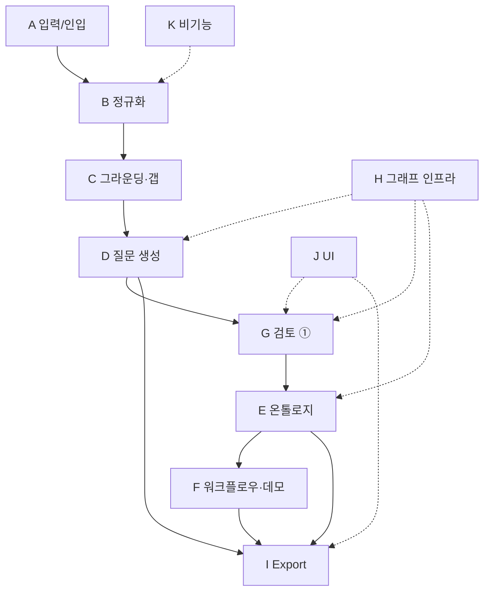

# Domain Pack Builder — 기능 리스트 & 의존성

상태 태그: **[실제]** MVP 실제 구현 · **[간소]** MVP 간소 구현 · **[목업]** 배선만/목업 · **[향후]** 프로덕션 단계
`depends_on`: 선행되어야 하는 기능 ID(내부) 또는 `외부:…`(기술 의존성). `—`는 진입점/무의존.

---

## A. 입력 & 문서 인입 (intake/parse)
| ID | 기능 | 설명 | 상태 | depends_on |
|---|---|---|---|---|
| F-A1 | 다중 문서 입력 | `documents[]`로 BRD·영업메모·이메일 등 수신 | 실제 | — |
| F-A2 | 문서 파싱 | 파일 → `kind/title/content`, PDF/PPT 텍스트 추출 | 실제 | F-A1, 외부:텍스트추출 |
| F-A3 | kind 자동 판별 | 확장자·파일명·헤더 규칙 | 간소 | F-A2 |
| F-A4 | 긴 문서 청킹 | 문단 경계 분할(size/overlap) | 실제 | F-A2 |
| F-A5 | problem 힌트 입력 | 선택적 한 줄 요약 | 간소 | — |

## B. 정규화 & 근거 매핑 (intake)
| ID | 기능 | 설명 | 상태 | depends_on |
|---|---|---|---|---|
| F-B1 | 6필드 의미 추출 | goals/pain_points/kpis/systems/constraints/stakeholders | 실제 | F-A4, 외부:LLM |
| F-B2 | map-reduce 처리 | 문서·청크별 추출 후 병합 | 실제 | F-B1 |
| F-B3 | 의미 중복 제거 | 문자 정규화 dedup | 실제 | F-B2 |
| F-B4 | 근거 문서 매핑 | 코드 후보검색 + LLM 검증 → `sources:[title]` | 실제 | F-B3, F-A1, 외부:LLM |
| F-B5 | 할루시 가드 | 근거 0개 항목 제거 | 실제 | F-B4 |
| F-B6 | 표시용 요약 | `problem` 한 줄(결정론) | 실제 | F-B5 |
| F-B7 | 항목 상한(cap) | 필드별 개수 제한 | 간소 | F-B5 |

## C. 그라운딩 & 갭 분석 (retrieve)
| ID | 기능 | 설명 | 상태 | depends_on |
|---|---|---|---|---|
| F-C1 | 레퍼런스 스키마 로드 | 산업키→표준(TPC-H), `dbgen` | 간소 | 외부:DuckDB/TPC-H |
| F-C2 | 스키마 introspect | 테이블·컬럼·PK/FK | 실제 | F-C1 |
| F-C3 | 샘플 행 추출 | 테이블별 N행 | 실제 | F-C1 |
| F-C4 | 키 컬럼 프로파일링 | row·distinct·min/max | 간소 | F-C1 |
| F-C5 | gold_questions 로드 | 22 인텐트(상수) | 실제 | F-C1 |
| F-C6 | 예상 스키마 추론 | ProblemProfile→필요 엔티티/필드 | 실제 | F-B5, 외부:LLM |
| F-C7 | 스키마 갭 분석 | matched/missing/extra | 실제 | F-C2, F-C6 |
| F-C8 | 레퍼런스 교체 구조 | 산업별 스키마 플러그인 | 향후 | F-C1 |
| F-C9 | 실제 RAG | 과거 PoC 문서 검색 | 향후 | 외부:벡터스토어 |

## D. 질문 생성 (gen_questions)
| ID | 기능 | 설명 | 상태 | depends_on |
|---|---|---|---|---|
| F-D2 | 커버리지 영역 도출 | kpis/profile 기반 | 실제 | F-B5 |
| F-D3 | 앵커 few-shot | gold 22쿼리 의역 2~3 | 실제 | F-C5 |
| F-D1 | 컨텍스트 조립 | 커버리지+앵커+스키마+갭 | 실제 | F-B5, F-C2, F-C3, F-C7, F-D2, F-D3 |
| F-D4 | 구조화 질문 생성 | tool-calling 스키마 강제 | 실제 | F-D1, 외부:LLM |
| F-D5 | 실 컬럼 바인딩 | linked_sources 실제 컬럼만 | 실제 | F-D4, F-C2 |
| F-D6 | 갭 태깅 | data_status: available/missing | 실제 | F-D4, F-C7 |
| F-D7 | 검증(validate) | 참조·커버리지·dedup | 실제 | F-D4, F-C2, F-D2 |
| F-D8 | 자동 보정 1회 | 검증 실패 시 재생성 | 실제 | F-D7 |

## E. 온톨로지 생성 (gen_ontology)
| ID | 기능 | 설명 | 상태 | depends_on |
|---|---|---|---|---|
| F-E1 | FK 스켈레톤 | 테이블→노드, FK→관계(코드) | 실제 | F-C2 |
| F-E2 | LLM 비즈니스 매핑 | 추상·relabel | 실제 | F-E1, F-G4(승인질문), 외부:LLM |
| F-E3 | maps_from | 노드↔출처 테이블/컬럼 | 실제 | F-E2 |
| F-E4 | 질문 링크 | answers = question.id | 실제 | F-E2 |
| F-E5 | 관계 의미화 | relations label | 실제 | F-E2 |
| F-E6 | 검증 | 관계 양끝·질문 커버·dedup | 실제 | F-E2, F-E3, F-E4, F-E5 |

## F. 워크플로우 & 데모 (gen_workflows / gen_demo)
| ID | 기능 | 설명 | 상태 | depends_on |
|---|---|---|---|---|
| F-F1 | 워크플로우 생성 | 2~3개, tool-calling | 간소 | F-E6, 외부:LLM |
| F-F2 | id 강제 참조 | answers_question·uses_nodes | 간소 | F-F1, F-D4, F-E4 |
| F-F3 | 워크플로우 검증 | 참조 id 존재 확인 | 간소 | F-F2 |
| F-F4 | 대표 워크플로우 선택 | pick_top(결정론) | 간소 | F-F3 |
| F-F5 | 데모 시나리오 생성 | narrative·steps·based_on | 간소 | F-F4, 외부:LLM |

## G. 휴먼인더루프 검토 (review ①②③)
| ID | 기능 | 설명 | 상태 | depends_on |
|---|---|---|---|---|
| F-G1 | review① 인터럽트 | payload(items+coverage)→UI 정지 | 실제 | F-D8, F-H1, F-H4 |
| F-G2 | 3버튼 | 승인/인라인 수정/피드백 재생성 | 실제 | F-G1, F-J4 |
| F-G3 | resume 처리 | action별 state 기록 | 실제 | F-G1 |
| F-G4 | 재생성 루프 | 피드백 누적→생성 노드 복귀 | 실제 | F-G3, F-H2 |
| F-G5 | 재시도 상한 | max_attempts 강제 통과 | 실제 | F-G4, F-H3 |
| F-G6 | 커버리지 리포트 | 채운/빠진 영역 표시 | 실제 | F-D2, F-D7 |
| F-G7 | review② 활성화 | 온톨로지 라이브 검토 | 향후 | F-G1(패턴), F-E6 |
| F-G8 | review③ 서브라우터 | 워크플로우/데모 개별 재생성 | 향후 | F-G1(패턴), F-H6 |

## H. 오케스트레이션 & 그래프 인프라
| ID | 기능 | 설명 | 상태 | depends_on |
|---|---|---|---|---|
| F-H3 | 상태 스키마 | DomainPackState 정의 | 실제 | — |
| F-H1 | StateGraph 조립 | 10노드 + 엣지 | 실제 | F-H3, 외부:LangGraph |
| F-H2 | 조건부 라우터 | route_questions/ontology/final | 실제 | F-H1 |
| F-H4 | 체크포인터 | MemorySaver + thread_id | 실제 | F-H1, 외부:LangGraph |
| F-H5 | ②③ 자동승인 스텁 | 통과 처리 | 목업 | F-H1 |
| F-H6 | ③ 서브라우터 배선 | regen_workflows/regen_demo | 목업 | F-H2 |

## I. Export & 산출물 (assemble_export)
| ID | 기능 | 설명 | 상태 | depends_on |
|---|---|---|---|---|
| F-I1 | required_sources 집계 | linked ∪ maps_from ∪ missing | 간소 | F-D5, F-E3, F-C7 |
| F-I2 | available/needed 구분 | 확보됨/확보 필요 분리 | 간소 | F-I1 |
| F-I3 | MD 체크리스트 렌더 | PoC 셋업 체크리스트 | 간소 | F-I2, F-D4, F-E6, F-F5 |
| F-I4 | Notion Export | MD 복사 목업 | 목업 | F-I3 |

## J. UI / 화면
| ID | 기능 | 설명 | 상태 | depends_on |
|---|---|---|---|---|
| F-J1 | Industry Selector | 산업 선택(MVP 고정 표시) | 간소 | — |
| F-J2 | 문서 입력 화면 | 다중 업로드/붙여넣기 | 실제 | F-A1, 외부:프론트 |
| F-J3 | Generated Pack 뷰 | 질문·온톨로지·워크플로우·데모 | 실제 | F-D4, F-E6, F-F5, 외부:프론트 |
| F-J4 | 검토① 인터랙션 | 3버튼 + 피드백 입력 | 실제 | F-G1, 외부:프론트 |
| F-J5 | 갭/근거 표시 | data_status·sources 노출 | 실제 | F-D6, F-B4 |
| F-J6 | Export 화면 | 복사/다운로드 | 간소 | F-I3 |
| F-J7 | 온톨로지 시각화 | 노드-관계 그래프 뷰 | 향후 | F-E6 |

## K. 비기능 / 횡단
| ID | 기능 | 설명 | 상태 | depends_on |
|---|---|---|---|---|
| F-K1 | 결정론 우선 | 파싱·집계·검증·렌더 코드화 | 실제 | 횡단 |
| F-K2 | 근거성/추적성 | provenance + 할루시 가드 | 실제 | F-B4, F-B5 |
| F-K3 | PII 마스킹 | 민감정보 처리 | 향후 | F-A2 |
| F-K4 | 임베딩 업그레이드 | 근거 검색·dedup 정밀화 | 향후 | F-B3, F-B4, 외부:임베딩 |
| F-K5 | 멱등성 | 저온도 추출 재현성 | 실제 | 외부:LLM |
| F-K6 | 산업 확장성 | 레퍼런스/커버리지 확장 | 향후 | F-C8 |

---

## 외부(기술) 의존성
| 의존성 | 사용 기능 | 비고 |
|---|---|---|
| LangGraph (graph/interrupt/checkpointer) | F-H1, F-H2, F-H4, F-G1~G5 | 파이프라인·휴먼인더루프 핵심 |
| Claude tool-calling (구조화 출력) | F-B1, F-B4, F-C6, F-D4, F-E2, F-F1, F-F5 | 모든 LLM 생성/추출 |
| DuckDB + TPC-H 확장 | F-C1~F-C5 | 레퍼런스 시드(`dbgen`) |
| 텍스트 추출 라이브러리 (PDF/PPT) | F-A2 | 비텍스트 문서 인입 |
| 임베딩 모델 (선택) | F-B4, F-K4, F-C9 | 근거 후보검색·의미 dedup 업그레이드 |
| 프론트엔드 | F-J2~F-J6 | 입력·검토·Export 화면 |

---

## 빌드 순서 (의존성 기반 Phase)
- **Phase 0 — 기반**: F-H3(상태) → F-H1(그래프) → F-A1/F-A2(입력 계약) → F-C1(TPC-H 환경)
- **Phase 1 — intake**: F-A4 → F-B1 → F-B2 → F-B3 → F-B4 → F-B5 (→ F-B6/B7)
- **Phase 2 — 그라운딩/갭**: F-C2·C3·C5 → F-C6 → F-C7
- **Phase 3 — 질문 생성**: F-D2·D3 → F-D1 → F-D4 → F-D5·D6 → F-D7 → F-D8
- **Phase 4 — 라이브 검토**: F-H4 → F-G1 → F-J4·F-G2 → F-G3 → F-H2·F-G4 → F-G5 (F-G6)
- **Phase 5 — 온톨로지**: F-E1 → F-E2 → F-E3·E4·E5 → F-E6 (+ F-H5 스텁)
- **Phase 6 — 워크플로우/데모**: F-F1 → F-F2 → F-F3 → F-F4 → F-F5
- **Phase 7 — Export/UI**: F-I1 → F-I2 → F-I3 → F-J3·J5·J6

> MVP 핵심 경로(라이브 데모 성립 조건): **Phase 0 → 1 → 2 → 3 → 4 → 5 → 7** (Phase 6은 간소 구현).

---

## 영역 의존성 다이어그램

